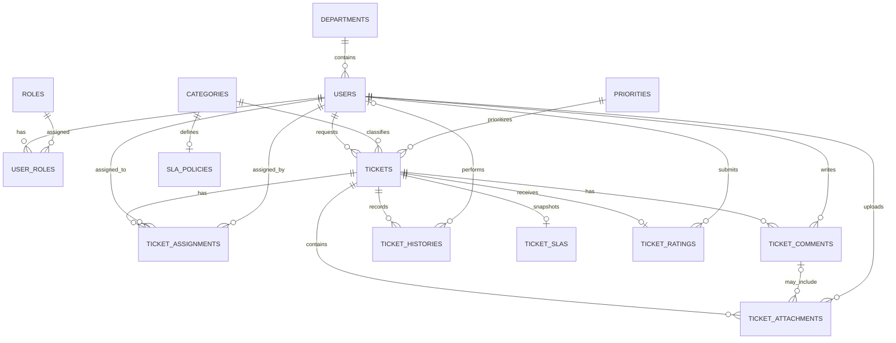

# Entity Relationship Diagram

```mermaid
erDiagram
    DEPARTMENTS ||--o{ USERS : contains
    USERS ||--o{ USER_ROLES : has
    ROLES ||--o{ USER_ROLES : assigned
    USERS ||--o{ TICKETS : requests
    CATEGORIES ||--o{ TICKETS : classifies
    PRIORITIES ||--o{ TICKETS : prioritizes
    CATEGORIES ||--o| SLA_POLICIES : defines
    TICKETS ||--o{ TICKET_ASSIGNMENTS : has
    USERS ||--o{ TICKET_ASSIGNMENTS : assigned_to
    USERS ||--o{ TICKET_ASSIGNMENTS : assigned_by
    TICKETS ||--o{ TICKET_COMMENTS : has
    USERS ||--o{ TICKET_COMMENTS : writes
    TICKETS ||--o{ TICKET_ATTACHMENTS : contains
    TICKET_COMMENTS o|--o{ TICKET_ATTACHMENTS : may_include
    USERS ||--o{ TICKET_ATTACHMENTS : uploads
    TICKETS ||--o{ TICKET_HISTORIES : records
    USERS o|--o{ TICKET_HISTORIES : performs
    TICKETS ||--o| TICKET_SLAS : snapshots
    TICKETS ||--o| TICKET_RATINGS : receives
    USERS ||--o{ TICKET_RATINGS : submits
```

Notifications menggunakan relasi polymorphic Laravel dan tidak ditampilkan pada ERD inti.
